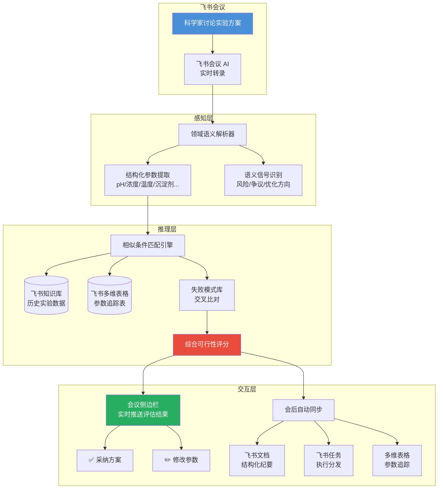

# AI 实验研发加速器 — 飞书会议 AI × 智能自主实验室

> **将飞书会议 AI 从"速记员"升级为"实验参谋"——在方案讨论阶段实时推演实验可行性**
>
> 🏆 字节跳动 AI 先锋大赛 · 晶泰科技赛道 | XtalPi Intelligent Autonomous Lab

[](LICENSE)
[]()

---

## Abstract (EN)

A structural inefficiency persists in intelligent autonomous laboratories: while experiment execution is increasingly automated, the upstream decision-making process—where scientists discuss and determine experimental parameters in meetings—remains entirely dependent on individual expertise. This project embeds a **real-time experiment feasibility inference engine** into Feishu (Lark) Meetings. During R&D discussions, the engine extracts experimental parameters from conversation streams, retrieves and compares historical experiment data, and instantly outputs feasibility scores, risk flags, and parameter-level optimization suggestions—shifting the failure interception point from "after the experiment fails" to "before the experiment is approved."

---

## 问题定义

药物研发约 **60% 的支出** 消耗于最终未能获批的候选分子（Deloitte, 2025），而临床前阶段每一轮失败的实验迭代平均损耗数万元直接成本与 1–2 周周期。这些失败中，相当比例在方案设计阶段即可通过历史数据比对被识别和规避——但当前没有一个系统将"会议室中的决策"与"历史实验数据"实时连接。

晶泰科技已建成全球最大规模的商业 AI+机器人实验工站集群（300+ 台），但其 DMTA 闭环的 **D→M（设计→制造）衔接处**，仍完全依赖参会科学家的个人经验判断——这是整个飞轮中唯一未被智能化的环节。

---

## 解决方案



**核心逻辑**：在科学家讨论实验方案的同时，AI 即时调取历史实验数据进行相似条件比对，当场回答三个问题——**这个方案可行吗？（可行性评分）有什么风险？（失败模式匹配）怎么改更好？（参数级建议）**

---

## 核心创新

| 维度 | 常规方案 | 本方案 |
|------|---------|--------|
| **AI 角色** | 速记员（被动记录） | 实验参谋（主动推演） |
| **介入时机** | 会议结束后 | 方案讨论中 |
| **价值形态** | 省写纪要的时间 | 省做失败实验的钱和周期 |
| **数据流向** | 存起来以后搜 | 实时调出来做判断 |
| **领域适配** | 通用语义理解 | 化学/制药垂直语义层 |

---

## 预期价值（保守测算）

| 指标 | 数值 |
|------|------|
| 拦截低可行性实验 | 方案阶段过滤 ~15% |
| 单次湿实验直接成本 | ¥500–5,000（试剂+耗材+仪器） |
| 每轮迭代周期 | 3–7 天 |
| 年度节省 | **数百万元 + 1–2 轮迭代周期** |
| 战略价值 | 隐性经验 → 可量化推演规则，降低对个别专家的依赖 |

---

## 技术可行性

- **100% 基于飞书开放平台现有能力**：会议 AI 转录、开放平台事件订阅、文档 API、多维表格 Bitable API、知识库 API
- **无需自研大模型**：领域适配通过 Prompt 工程 + 术语词典实现
- **无高算力依赖**：推演引擎核心为相似度匹配 + 规则引擎
- **落地路径清晰**：单项目组试点（1–2 周）→ 全实验线 → 跨业务线推广

---

## Demo 数据：共晶实验历史数据库

为验证方案可行性，我们在飞书多维表格中搭建了一套模拟的**共晶实验历史数据库**，作为 AI 推演引擎的"燃料"。

### 数据概览

| 指标 | 数值 |
|------|------|
| 总实验记录 | **55 条** |
| 覆盖靶点 | CDK7(21) / CDK4(11) / CDK9(11) / EGFR(6) / KRAS(6) |
| 温度分布 | 4°C(7) / 25°C(27) / 37°C(21) |
| 成功案例 | 高结晶率(>50%) |
| 失败案例 | 低结晶率 / 蛋白沉淀 / 无晶体 |

### 数据规律（供 AI 推演验证）

- **pH 效应**：pH 5.5–6.5 区域多数失败（蛋白沉淀），pH 7.0–8.5 区域多数成功
- **温度效应**：4°C 低温条件结晶率普遍优于 25°C 和 37°C
- **PEG 浓度**：>25% 高浓度 PEG 多数导致失败（析出/降解）
- **添加剂效应**：含"0.1M NaI"或"10%甘油"的成功案例分辨率普遍更高
- **蛋白浓度**：10–15 mg/ml 为最佳区间

### 文件说明

```
demo-data/
├── 共晶实验历史数据库.xlsx                              ← Excel 原始文件
├── 共晶实验历史数据库_共晶实验表.csv                     ← CSV 导出（实验明细）
└── 共晶实验历史数据库_共晶实验表_全部实验.csv            ← CSV 导出（含全部字段）

assets/
└── dashboard-screenshot.png                              ← 飞书多维表格仪表盘截图
```

> 评委可下载 CSV 查看完整数据，验证数据逻辑与标签一致性。

---

## 仓库结构

```
.
├── README.md                              ← 项目主页（你在这里）
├── AI实验研发加速器-核心方案V2.md           ← 完整方案文档
│   ├── 命题前置分析与洞察（Part 1）
│   ├── 整体解决方案设计（Part 2）
│   ├── 场景演示（会议实况推演）
│   ├── 技术实现路径
│   └── 提交物拆解 & 行动计划
└── 参考信息-行业报告与竞品案例.md            ← 行业数据 & 竞品分析
    ├── 行业痛点数据（含来源 & 时间）
    ├── 竞品分析（Benchling / Sapio / 飞书客户）
    ├── 用户真实反馈
    └── 关键引用速查表
```

---

## 参考资料（精选）

| 来源 | 关键数据 | 年份 |
|------|---------|------|
| Deloitte | Top 20 药企 60% R&D 支出消耗于失败候选分子 | 2025 |
| Sapio Sciences / The Scientist | 71% 科研人员因找不到历史结果重复实验 | 2025 |
| MedCity News | 10 人 R&D 团队年损 $100 万于信息检索 | 2025 |
| Drug Discovery Today | 资深科学家离职 → 知识真空级联扩散 | 2025 |
| Nature Chemical Engineering | AI Advisor 实时监控实验 + 策略切换 | 2025 |
| 晶泰科技 2025 年报 | 全年营收 8.03 亿，+100%；自动化收入 2.65 亿，+62.6% | 2025 |

---

> **飞书会议不是知识的终点，而是决策智能化的起点。**
