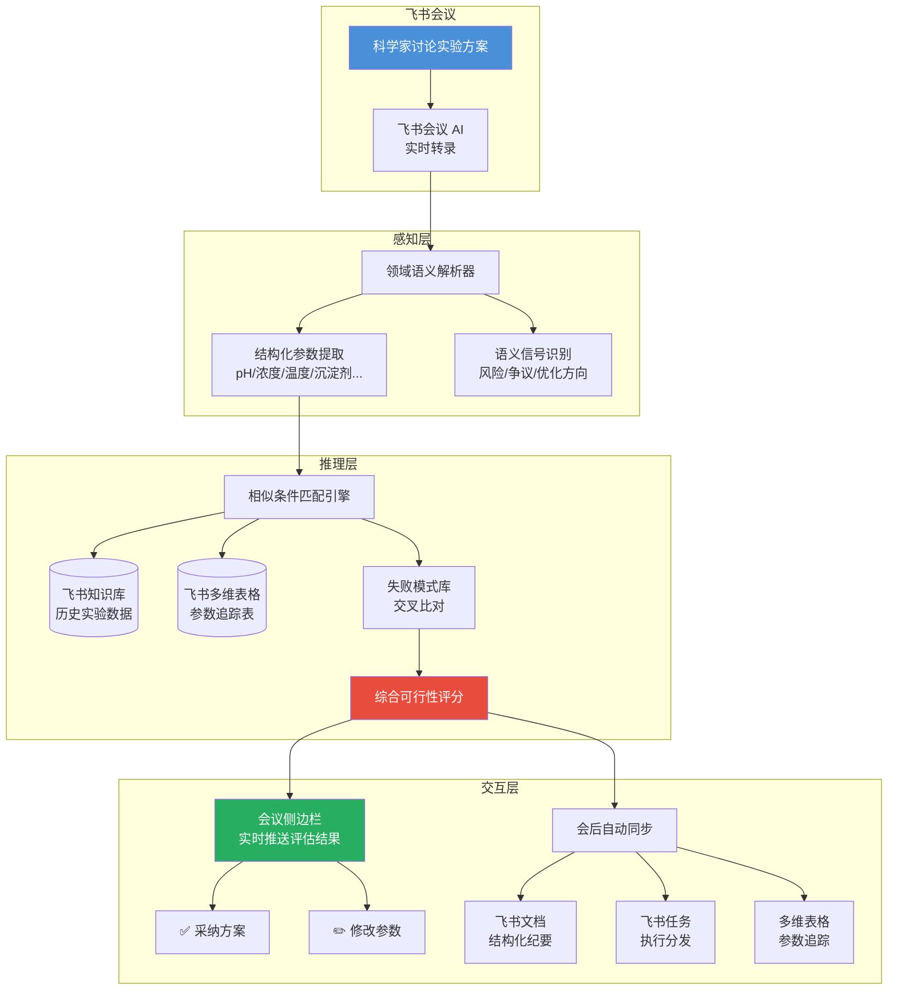

# AI 实验研发加速器 — 飞书会议 AI × 智能自主实验室

> **将飞书会议 AI 从"速记员"升级为"实验参谋"——在方案讨论阶段实时推演实验可行性**
>
> 🏆 字节跳动 AI 先锋大赛 · 晶泰科技赛道 | XtalPi Intelligent Autonomous Lab

[](LICENSE)
[]()

---

## Abstract (EN)

A structural inefficiency persists in intelligent autonomous laboratories: while experiment execution is increasingly automated, the upstream decision-making process—where scientists discuss and determine experimental parameters in meetings—remains entirely dependent on individual expertise. This project embeds a **real-time experiment feasibility inference engine** into Feishu (Lark) Meetings. During R&D discussions, the engine extracts experimental parameters from conversation streams, retrieves and compares historical experiment data, and instantly outputs feasibility scores, risk flags, and parameter-level optimization suggestions—shifting the failure interception point from "after the experiment fails" to "before the experiment is approved."

---

## 问题定义

药物研发约 **60% 的支出** 消耗于最终未能获批的候选分子（Deloitte, 2025），而临床前阶段每一轮失败的实验迭代平均损耗数万元直接成本与 1–2 周周期。这些失败中，相当比例在方案设计阶段即可通过历史数据比对被识别和规避——但当前没有一个系统将"会议室中的决策"与"历史实验数据"实时连接。

晶泰科技已建成全球最大规模的商业 AI+机器人实验工站集群（300+ 台），但其 DMTA 闭环的 **D→M（设计→制造）衔接处**，仍完全依赖参会科学家的个人经验判断——这是整个飞轮中唯一未被智能化的环节。

---

## 解决方案



**核心逻辑**：在科学家讨论实验方案的同时，AI 即时调取历史实验数据进行相似条件比对，当场回答三个问题——**这个方案可行吗？（可行性评分）有什么风险？（失败模式匹配）怎么改更好？（参数级建议）**

---

## 核心创新

| 维度 | 常规方案 | 本方案 |
|------|---------|--------|
| **AI 角色** | 速记员（被动记录） | 实验参谋（主动推演） |
| **介入时机** | 会议结束后 | 方案讨论中 |
| **价值形态** | 省写纪要的时间 | 省做失败实验的钱和周期 |
| **数据流向** | 存起来以后搜 | 实时调出来做判断 |
| **领域适配** | 通用语义理解 | 化学/制药垂直语义层 |

---

## 预期价值（保守测算）

| 指标 | 数值 |
|------|------|
| 拦截低可行性实验 | 方案阶段过滤 ~15% |
| 单次湿实验直接成本 | ¥500–5,000（试剂+耗材+仪器） |
| 每轮迭代周期 | 3–7 天 |
| 年度节省 | **数百万元 + 1–2 轮迭代周期** |
| 战略价值 | 隐性经验 → 可量化推演规则，降低对个别专家的依赖 |

---

## 技术可行性

- **100% 基于飞书开放平台现有能力**：会议 AI 转录、开放平台事件订阅、文档 API、多维表格 Bitable API、知识库 API
- **无需自研大模型**：领域适配通过 Prompt 工程 + 术语词典实现
- **无高算力依赖**：推演引擎核心为相似度匹配 + 规则引擎
- **落地路径清晰**：单项目组试点（1–2 周）→ 全实验线 → 跨业务线推广

---

## 🚀 快速开始：5 分钟搭建你的实验推演助手

### 适用场景

- 你有历史实验数据（Excel/CSV）
- 你想在开会讨论方案时，让 AI 实时告诉你"这个参数行不行"
- 你已经在用飞书

### 整体流程

```
准备实验数据 → 导入飞书多维表格 → 配置扣子 AI → 开始推演
```

---

### 步骤 1：准备实验数据库（飞书多维表格）

**目标**：把历史实验记录变成 AI 可读的"燃料"

| 动作 | 操作 | 说明 |
|------|------|------|
| 1.1 | 登录 [feishu.cn](https://www.feishu.cn) → 云文档 → 新建「多维表格」 | 不是普通表格，是多维表格 |
| 1.2 | 创建字段（列） | 至少包含：实验编号、靶点、参数（pH/浓度/温度等）、结果、标签 |
| 1.3 | 导入数据 | 右上角「···」→「导入」→ 上传你的 CSV/Excel |
| 1.4 | 验证数据 | 检查标签和数值是否匹配（如结晶率>50%不能标"失败"）|

**字段建议（以共晶实验为例）**：

| 字段名 | 类型 | 示例 |
|--------|------|------|
| 实验编号 | 文本 | CRYST-001 |
| 靶点蛋白 | 单选 | CDK7 |
| pH | 数字 | 7.5 |
| 蛋白浓度 | 数字 | 15 |
| 温度 | 单选 | 4°C / 25°C |
| 沉淀剂 | 单选 | PEG3350 |
| PEG浓度 | 数字 | 18 |
| 添加剂 | 文本 | 0.1M NaI |
| 结晶率 | 数字 | 78 |
| 分辨率 | 数字 | 1.8 |
| 结果标签 | 单选 | ✅最优 / ✅可用 / ❌沉淀 |

> 💡 **数据量建议**：至少 30 条以上，覆盖成功和失败案例，AI 才有足够样本做比对。

---

### 步骤 2：配置 AI 推演助手（扣子 Coze）

扣子支持**两种模式**，按需选择：

#### 模式 A：接入本地 Agent（免费，我们实际采用）

适合：想用自己的电脑运行 AI，或需要访问本地文件

| 步骤 | 操作 |
|------|------|
| 2.1 | 打开 [coze.cn](https://www.coze.cn) → 登录 → 点「接入本地 Agent」 |
| 2.2 | 复制系统生成的连接命令 |
| 2.3 | 在本机终端运行该命令（需要 Node.js 环境） |
| 2.4 | 返回扣子页面，点击「我已执行」完成配对 |
| 2.5 | 本地 Claude Code / 其他 AI 助手即成为扣子 Agent |

**本地 Agent 的优势**：
- ✅ 完全免费，无调用额度限制
- ✅ 可读取本地文件（CSV、Excel、数据库）
- ✅ 可用自己的 API Key（OpenAI/Claude/DeepSeek 等）

#### 模式 B：使用扣子云端模型（按量付费）

适合：不想配置本地环境，快速上线

| 步骤 | 操作 |
|------|------|
| 2.1 | 打开 [coze.cn](https://www.coze.cn) → 创建 Bot |
| 2.2 | 选择扣子内置模型（豆包/云雀等）或接入自己的 API Key |
| 2.3 | 在「知识库」中上传你的 CSV 文件 |
| 2.4 | 配置人设 Prompt（见下方模板） |
| 2.5 | 发布到飞书 |

---

### 步骤 3：配置人设 Prompt

在扣子 Agent/Bot 的「人设与回复逻辑」中粘贴：

```markdown
## 角色
你是[你的实验室名称]的 AI 实验推演助手。
你拥有[实验类型]的历史数据库访问权限。

## 任务
当用户输入实验参数时：
1. 从知识库中检索最相似的 5-10 条历史实验记录
2. 分析当前方案的可行性（给出百分比评分）
3. 标注具体风险点
4. 给出参数级优化建议
5. 引用相似历史实验编号作为证据

## 输出格式
🎯 方案可行性评估：XX%（高/中/低）
🔴 主要风险：（逐条列出）
💡 改进建议：（逐条列出，含预期效果）
📊 支撑数据：（引用历史实验编号）

## 约束
- 只基于知识库中的历史数据做推断，不编造数据
- 如果参数组合在历史数据中从未出现，明确告知"历史数据不足"
- 改进建议要具体到参数数值
```

> 📝 **替换提示**：把 `[你的实验室名称]` 和 `[实验类型]` 换成你自己的。

---

### 步骤 4：开始推演

**方式 1：飞书群聊 @Agent**

在飞书群里 @你的 Agent，输入：
```
评估方案：靶点 CDK7，pH 6.0，蛋白浓度 12mg/ml，温度 25°C，
沉淀剂 PEG3350，浓度 25%，缓冲液 Tris 7.5，无添加剂
```

**方式 2：扣子对话窗口直接输入**

在扣子的预览/调试窗口或对话界面中直接输入参数。

---

### 📂 本项目文件对应关系

```
ai-lab-accelerator/
├── demo-data/
│   ├── 共晶实验历史数据库.xlsx              ← 步骤 1：你的数据源模板
│   └── 共晶实验历史数据库_共晶实验表.csv     ← 步骤 2：导入扣子的知识库
├── assets/
│   ├── demo-failure/                         ← 步骤 4：失败方案推演截图
│   └── demo-success/                         ← 步骤 4：成功方案推演截图
└── AI实验研发加速器-方案文档.html            ← 完整方案（含Demo）
```

---

## Demo 数据：共晶实验历史数据库

为验证方案可行性，我们在飞书多维表格中搭建了一套模拟的**共晶实验历史数据库**，作为 AI 推演引擎的"燃料"。

### 数据概览

| 指标 | 数值 |
|------|------|
| 总实验记录 | **55 条** |
| 覆盖靶点 | CDK7(21) / CDK4(11) / CDK9(11) / EGFR(6) / KRAS(6) |
| 温度分布 | 4°C(7) / 25°C(27) / 37°C(21) |
| 成功案例 | 高结晶率(>50%) |
| 失败案例 | 低结晶率 / 蛋白沉淀 / 无晶体 |

### 数据规律（供 AI 推演验证）

- **pH 效应**：pH 5.5–6.5 区域多数失败（蛋白沉淀），pH 7.0–8.5 区域多数成功
- **温度效应**：4°C 低温条件结晶率普遍优于 25°C 和 37°C
- **PEG 浓度**：>25% 高浓度 PEG 多数导致失败（析出/降解）
- **添加剂效应**：含"0.1M NaI"或"10%甘油"的成功案例分辨率普遍更高
- **蛋白浓度**：10–15 mg/ml 为最佳区间

### 文件说明

```
demo-data/
├── 共晶实验历史数据库.xlsx                              ← Excel 原始文件
├── 共晶实验历史数据库_共晶实验表.csv                     ← CSV 导出（实验明细）
└── 共晶实验历史数据库_共晶实验表_全部实验.csv            ← CSV 导出（含全部字段）

assets/
└── dashboard-screenshot.png                              ← 飞书多维表格仪表盘截图
```

> 评委可下载 CSV 查看完整数据，验证数据逻辑与标签一致性。

---

## Demo 演示：AI 实时推演实验可行性

基于飞书多维表格中的 55 条历史实验数据，本地 AI 助手可对任意输入的实验方案进行实时推演。

### 推演对比

| 维度 | 失败方案（原始） | 改进方案（优化后） |
|------|----------------|-------------------|
| **靶点** | CDK7 | CDK7 |
| **pH** | 6.0 | 7.5 |
| **蛋白浓度** | 12 mg/ml | 15 mg/ml → 12.5 mg/ml |
| **温度** | 25°C | 4°C |
| **沉淀剂** | PEG3350 | PEG3350 |
| **PEG浓度** | 25% | 18% → 15% |
| **缓冲液** | Tris 7.5 | Tris 7.5 |
| **添加剂** | 无 | 0.1M NaI |
| **可行性评分** | **0%** ❌ | **75%** ✅ |
| **历史依据** | 三个禁区：pH 6.0 成功率 0%、PEG>20% 无先例 | pH 7.5 最优区间、4°C 强正向、NaI 100% 成功率 |

### 失败方案推演截图

| 步骤 | 说明 |
|------|------|
| 01-input | 用户输入原始实验参数 |
| 02-analysis | AI 检索相似历史实验 |
| 03-similar-records | 列出相似实验数据对比 |
| 04-conclusion | **核心结论：三个参数踩中历史禁区，可行性 0%** |

### 改进方案推演截图

| 步骤 | 说明 |
|------|------|
| 01-input | 用户输入优化后参数 |
| 02-factor-analysis | AI 逐项评估参数因子（强正向/风险/略高） |
| 03-optimization | AI 给出参数微调建议（PEG 15%、蛋白 12.5 mg/ml） |
| 04-conclusion | 可行性从 60% 提升至 **75%** |
| 05-summary | 批量参数矩阵筛查建议 |

### 推演文件位置

```
assets/
├── dashboard-screenshot.png                 ← 飞书多维表格仪表盘
├── demo-failure/
│   ├── 01-input.png                         ← 输入：失败方案参数
│   ├── 02-analysis.png                      ← 分析：相似实验检索
│   ├── 03-similar-records.png               ← 对比：历史数据匹配
│   └── 04-conclusion.png                    ← 结论：0% 可行性
└── demo-success/
    ├── 01-input.png                         ← 输入：改进方案参数
    ├── 02-factor-analysis.png               ← 因子：逐项评级
    ├── 03-optimization.png                  ← 优化：参数微调建议
    ├── 04-conclusion.png                    ← 结论：75% 可行性
    └── 05-summary.png                       ← 总结：批量筛查建议
```

---

## 仓库结构

```
.
├── README.md                              ← 项目主页（你在这里）
├── AI实验研发加速器-核心方案V2.md           ← 完整方案文档
│   ├── 命题前置分析与洞察（Part 1）
│   ├── 整体解决方案设计（Part 2）
│   ├── 场景演示（会议实况推演）
│   ├── 技术实现路径
│   └── 提交物拆解 & 行动计划
└── 参考信息-行业报告与竞品案例.md            ← 行业数据 & 竞品分析
    ├── 行业痛点数据（含来源 & 时间）
    ├── 竞品分析（Benchling / Sapio / 飞书客户）
    ├── 用户真实反馈
    └── 关键引用速查表
```

---

## 参考资料（精选）

| 来源 | 关键数据 | 年份 |
|------|---------|------|
| Deloitte | Top 20 药企 60% R&D 支出消耗于失败候选分子 | 2025 |
| Sapio Sciences / The Scientist | 71% 科研人员因找不到历史结果重复实验 | 2025 |
| MedCity News | 10 人 R&D 团队年损 $100 万于信息检索 | 2025 |
| Drug Discovery Today | 资深科学家离职 → 知识真空级联扩散 | 2025 |
| Nature Chemical Engineering | AI Advisor 实时监控实验 + 策略切换 | 2025 |
| 晶泰科技 2025 年报 | 全年营收 8.03 亿，+100%；自动化收入 2.65 亿，+62.6% | 2025 |

---

> **飞书会议不是知识的终点，而是决策智能化的起点。**
